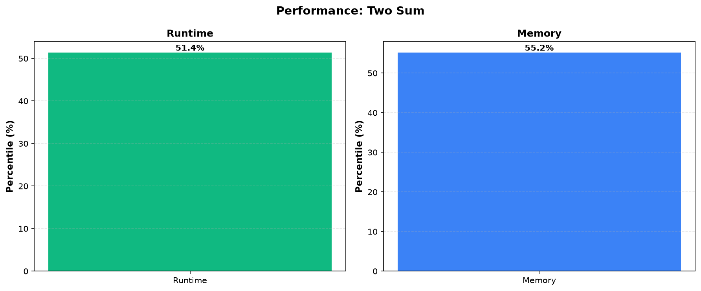

# Two Sum

**Difficulty:** Easy

**Problem Link:** [LeetCode](https://leetcode.com/problems/two-sum/)

**Status:** Accepted

## Performance

## Performance Metrics

| Language | Runtime Percentile | Memory Percentile |
|----------|-------------------|------------------|
| Golang | 51.38% | 55.19% |
| Cpp | 100.00% | 7.04% |

