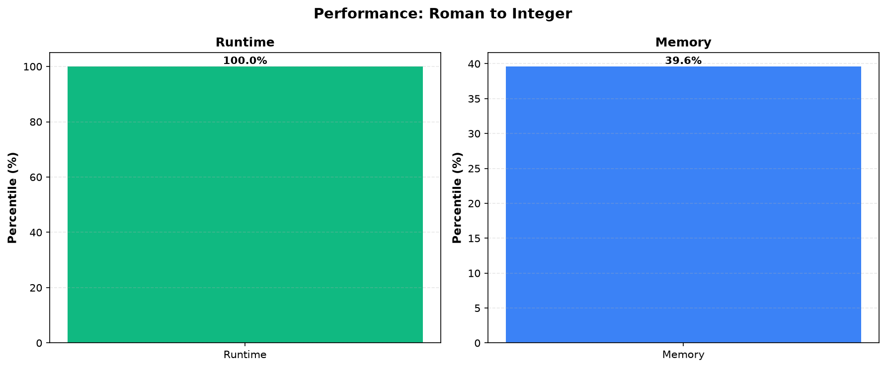

# Roman to Integer

**Difficulty:** Easy

**Problem Link:** [LeetCode](https://leetcode.com/problems/roman-to-integer/)

**Status:** Accepted

## Performance

## Performance Metrics

| Language | Runtime Percentile | Memory Percentile |
|----------|-------------------|------------------|
| Golang | 100.00% | 39.61% |
| Cpp | 34.97% | 52.00% |

