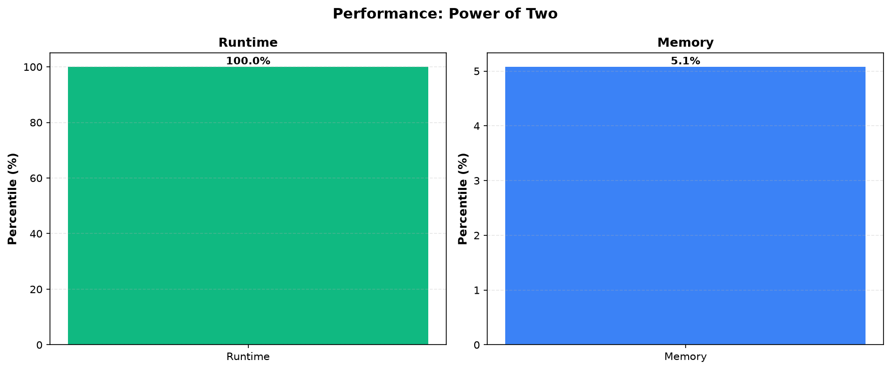

# Power of Two

**Difficulty:** Easy

**Problem Link:** [LeetCode](https://leetcode.com/problems/power-of-two/)

**Status:** Accepted

## Performance

## Performance Metrics

| Language | Runtime Percentile | Memory Percentile |
|----------|-------------------|------------------|
| Golang | 100.00% | 5.08% |

