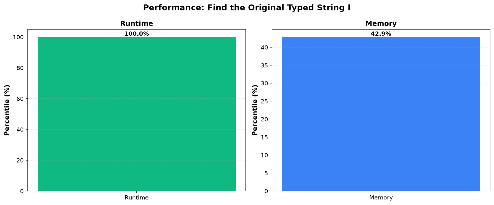

# Find the Original Typed String I

**Difficulty:** Easy

**Problem Link:** [LeetCode](https://leetcode.com/problems/find-the-original-typed-string-i/)

**Status:** Accepted

## Performance

## Performance Metrics

| Language | Runtime Percentile | Memory Percentile |
|----------|-------------------|------------------|
| Golang | 100.00% | 42.86% |
| Cpp | 24.22% | 5.47% |

