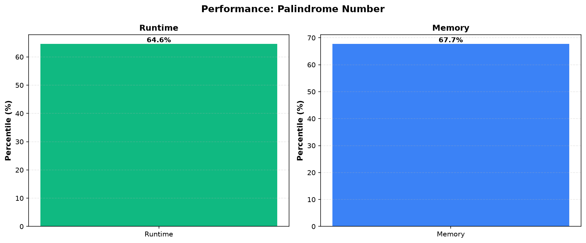

# Palindrome Number

**Difficulty:** Easy

**Problem Link:** [LeetCode](https://leetcode.com/problems/palindrome-number/)

**Status:** Accepted

## Performance

## Performance Metrics

| Language | Runtime Percentile | Memory Percentile |
|----------|-------------------|------------------|
| Golang | 64.61% | 67.73% |
| Cpp | 57.52% | 36.31% |

